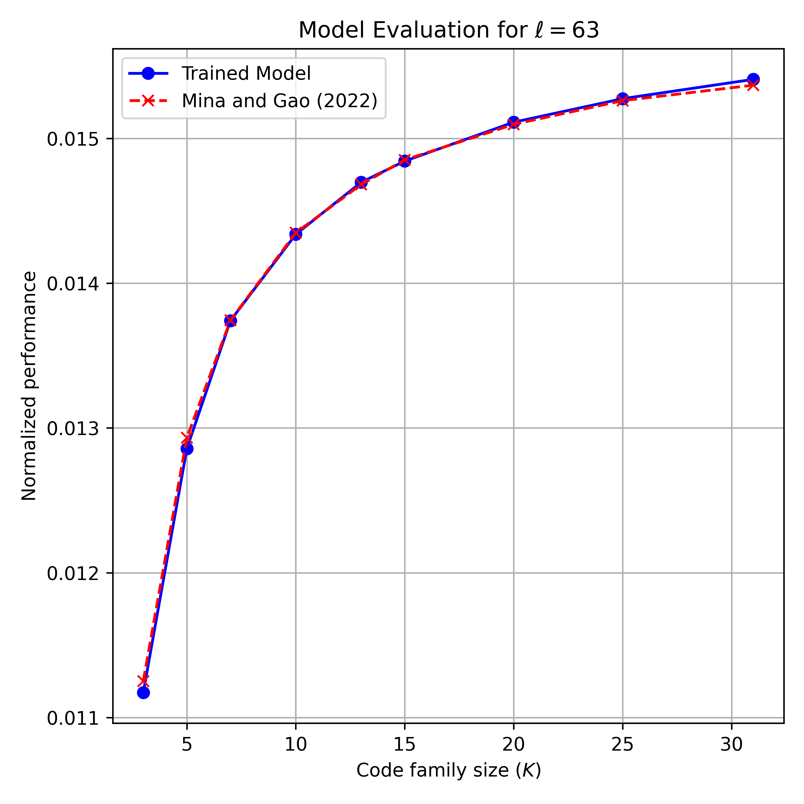
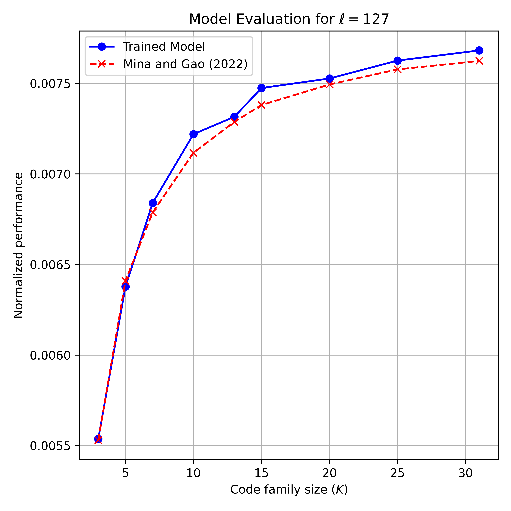

# PRN Code Generator Using NES Algorithm

This repository contains the Python implementation of the Natural Evolutionary (NES) Algorithm proposed and tested by Mina and Gao in 2022 [[1]](#1), which leverages machine learning to improve the correlation properties of Pseudorandom noise (PRN) codes used in Global Navigation Satellite Systems (GNSS).

## Overview
GNSS systems like GPS rely on PRN codes to ensure satellite signal identification and minimize interference. Traditional PRN codes, such as Gold Codes, are simple and deterministic, but modern computational capabilities allow us to explore more complex alternatives [[2]](#2). This project recreates the NES algorithm described by Mina and Gao [[1]](#1) to generate PRN code families with lower cross-correlation and non-central mean autocorrelation properties.

#### Key Features of the Repository:
- **NES Algorithm Implementation:** A Python-based implementation of the NES framework described by Mina and Gao.
- **Performance Benchmarking:** Comparisons with traditional Gold and Weil codes.
- **Training and Evaluation Data:** Training and evaluation data from all code length and code family size combinations is provided.
- **Research Paper:** A comprehensive paper detailing the implementation, results, and analysis.

#### Repository Contents:
- `/`: Research paper and Python package requirements.
- `code/`: Python scripts used in the NES algorithm, including:
  - `main.py`: Sampling, proposal distribution, objective function evaluation and training loop.
  - `evals.py`: Evaluation of the models' performance against the established Gold and Weil codes.
  - `utils.py`: Various utility functions, including data management, `Gold` and `Weil` class definitions.
- `data/`: CSV files containing the maximum loss at the end of model training.
- `plots/`: Training and evaluation plots featured in the research paper.

## Usage
#### Requirements
- Python 3.12.
- PyTorch with GPU support.
- Required Python packages can be installed via:
  ```bash
  pip install -r requirements.txt
  ```
#### Running the Code
1. Clone the repository:
   ```bash
   git clone https://github.com/amoec/prn-gen.git
   cd prn-gen
   ```
2. Train the PRN code generators:
   ```bash
   python code/main.py
   ```
   ***Note that any existing models and/or plots will be overwritten!***
3. Once the models are trained and saved, you can benchmark their performance using the existing `evals.py` code, or define your own in the `code/` directory:
   ```bash
   python code/evals.py
   ```
   ***Again, please note that this will overwrite any existing evaluation plots!***

## Results
The NES algorithm successfully generates PRN code families with superior correlation properties compared to traditional Gold and Weil codes. For detailed results, please efer to the included research paper in the `/` directory. Note that the use of mixed precision training to reduce GPU memory utilization is the likely culprit behind the deviation in model performance from the established literature, with a maximum performance percentage difference between the trained models and those reported by Mina and Gao [[1]](#1) of 11.65%.

This maximum percentage difference is indeed increasing with increaing code length, although the large jump in deviation between the $\ell=1023$ and $\ell=1031$ PRN codes from 4.59% to 11.65% indicating additional issues that remain to be addressed. Please also note the large computational requirements due to the rapidly increasing model sizes. 

### Evaluation Plots

#### Code Length 63

*Figure 1: Evaluation results for code length 63.*

#### Code Length 67

*Figure 2: Evaluation results for code length 67.*

#### Code Length 127

*Figure 3: Evaluation results for code length 127.*

#### Code Length 257

*Figure 4: Evaluation results for code length 257.*

#### Code Length 511

*Figure 5: Evaluation results for code length 511.*

#### Code Length 1023

*Figure 6: Evaluation results for code length 1023.*

#### Code Length 1031

*Figure 7: Evaluation results for code length 1031.*

## References
<a id="1">[1]</a> Mina, T. Y., and Gao, G. X., “Designing Low-Correlation GPS Spreading Codes with a Natural Evolution Strategy Machine-Learning Algorithm,” *Journal of the Institute of Navigation*, Vol. 69, No. 1, 2022. <doi:10.33012/navi.506>.

<a id="2">[2]</a> McCallum, J. C., “Memory Prices 1957 - 2024,” , 2024. URL https://jcmit.net/memoryprice.htm, Accessed: 2024-09-07.